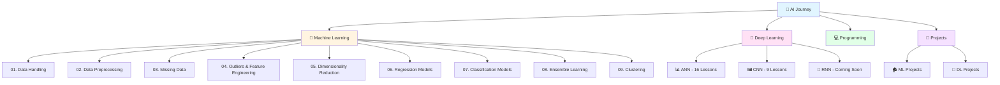

# 🤖 My Learning Journey with Artificial Intelligence

**A comprehensive collection of Machine Learning and Deep Learning implementations**

• [Machine Learning](#-machine-learning) • [Deep Learning](#-deep-learning) • [Projects](#-projects) • [Contributing](#-contributing)

---

## 📑 Table of Contents

- [Repository Structure](#-repository-structure)
- [Machine Learning](#-machine-learning)
- [Deep Learning](#-deep-learning)
- [Projects](#-projects)
- [Repository Stats](#-repository-stats)
- [Contributing](#-contributing)

---

## 📁 Repository Structure

### Quick Start

Navigate to any topic folder and open the corresponding Jupyter notebook to start learning!

---

## 🤖 Machine Learning

### [01. Data Handling](./Machine%20Learning/01.%20Data%20Handling)

| Day | Topic | Navigate | Content |
|-----|-------|----------|---------|
| Day 15 | Working with CSV Files | [📓](./Machine%20Learning/01.%20Data%20Handling/Day%2015%20-%20CSV.ipynb) | Reading, writing CSV data |
| Day 16 | JSON and SQL | [📓](./Machine%20Learning/01.%20Data%20Handling/Day%2016%20-%20JSON%20SQL.ipynb) | Working with JSON and SQL databases |
| Day 17 | API to DataFrame | [📓](./Machine%20Learning/01.%20Data%20Handling/Day%2017%20-%20API.ipynb) | Converting API responses to DataFrames |
| Day 18 | Web Scraping | [📓](./Machine%20Learning/01.%20Data%20Handling/Day%2018%20-%20Web%20Scraping.ipynb) | Creating DataFrames from scraped data |
| Day 19 | Descriptive Statistics | [📓](./Machine%20Learning/01.%20Data%20Handling/Day%2019%20-%20Statistics.ipynb) | Understanding data through statistics |
| Day 20 | Univariate Analysis | [📓](./Machine%20Learning/01.%20Data%20Handling/Day%2020%20-%20Univariate.ipynb) | Single variable analysis |
| Day 21 | Bivariate Analysis | [📓](./Machine%20Learning/01.%20Data%20Handling/Day%2021%20-%20Bivariate.ipynb) | Analyzing relationships between variables |
| Day 22 | Pandas Profiling | [📓](./Machine%20Learning/01.%20Data%20Handling/Day%2022%20-%20Profiling.ipynb) | Automated DataFrame profiling |

### [02. Data Preprocessing](./Machine%20Learning/02.%20Data%20Preprocessing)

| Day | Topic | Navigate | Content |
|-----|-------|----------|---------|
| Day 24 | Standardization | [📓](./Machine%20Learning/02.%20Data%20Preprocessing/Day%2024%20-%20Standardization.ipynb) | Z-score normalization |
| Day 25 | Normalization | [📓](./Machine%20Learning/02.%20Data%20Preprocessing/Day%2025%20-%20Normalization.ipynb) | Min-Max scaling |
| Day 26 | Ordinal Encoding | [📓](./Machine%20Learning/02.%20Data%20Preprocessing/Day%2026%20-%20Ordinal.ipynb) | Encoding ordered categorical variables |
| Day 27 | One Hot Encoding | [📓](./Machine%20Learning/02.%20Data%20Preprocessing/Day%2027%20-%20OneHot.ipynb) | Binary encoding for categories |
| Day 28 | Column Transformer | [📓](./Machine%20Learning/02.%20Data%20Preprocessing/Day%2028%20-%20ColumnTransformer.ipynb) | Different transformations per column |
| Day 29 | Sklearn Pipelines | [📓](./Machine%20Learning/02.%20Data%20Preprocessing/Day%2029%20-%20Pipeline.ipynb) | Reusable ML workflows |
| Day 30 | Function Transformer | [📓](./Machine%20Learning/02.%20Data%20Preprocessing/Day%2030%20-%20FunctionTransformer.ipynb) | Custom transformations |
| Day 31 | Power Transformer | [📓](./Machine%20Learning/02.%20Data%20Preprocessing/Day%2031%20-%20PowerTransformer.ipynb) | Box-Cox & Yeo-Johnson transformations |
| Day 32 | Binning & Binarization | [📓](./Machine%20Learning/02.%20Data%20Preprocessing/Day%2032%20-%20Binning.ipynb) | Discretization techniques |
| Day 33 | Mixed Variables | [📓](./Machine%20Learning/02.%20Data%20Preprocessing/Day%2033%20-%20Mixed.ipynb) | Handling mixed data types |
| Day 34 | Date and Time | [📓](./Machine%20Learning/02.%20Data%20Preprocessing/Day%2034%20-%20DateTime.ipynb) | DateTime feature engineering |

### [03. Handling Missing Data](./Machine%20Learning/03.%20Missing%20Data)

| Day | Topic | Navigate | Techniques |
|-----|-------|----------|------------|
| Day 35 | Complete Case Analysis | [📓](./Machine%20Learning/03.%20Missing%20Data/Day%2035%20-%20CompleteCase.ipynb) | Removing rows with missing values |
| Day 36 | Numerical Imputation | [📓](./Machine%20Learning/03.%20Missing%20Data/Day%2036%20-%20Numerical.ipynb) | Mean, median, arbitrary value imputation |
| Day 37 | Categorical Imputation | [📓](./Machine%20Learning/03.%20Missing%20Data/Day%2037%20-%20Categorical.ipynb) | Handling missing categorical data |
| Day 39 | KNN Imputer | [📓](./Machine%20Learning/03.%20Missing%20Data/Day%2039%20-%20KNN.ipynb) | K-Nearest Neighbors imputation |
| Day 40 | Iterative Imputer | [📓](./Machine%20Learning/03.%20Missing%20Data/Day%2040%20-%20Iterative.ipynb) | MICE imputation |

### [04. Outliers and Feature Engineering](./Machine%20Learning/04.%20Outliers%20Feature%20Engineering)

| Day | Topic | Navigate | Content |
|-----|-------|----------|---------|
| Day 42 | Z-Score Method | [📓](./Machine%20Learning/04.%20Outliers/Day%2042%20-%20ZScore.ipynb) | Outlier detection using Z-score |
| Day 43 | IQR Method | [📓](./Machine%20Learning/04.%20Outliers/Day%2043%20-%20IQR.ipynb) | Interquartile range method |
| Day 44 | Percentile Method | [📓](./Machine%20Learning/04.%20Outliers/Day%2044%20-%20Percentile.ipynb) | Percentile-based detection |
| Day 45 | Feature Engineering | [📓](./Machine%20Learning/04.%20Outliers/Day%2045%20-%20FeatureEngineering.ipynb) | Construction and splitting |

### [05. Dimensionality Reduction](./Machine%20Learning/05.%20Dimensionality%20Reduction)

| Day | Topic | Navigate | Content |
|-----|-------|----------|---------|
| Day 46-49 | Principal Component Analysis | [📓](./Machine%20Learning/05.%20Dimensionality/PCA.ipynb) | Eigenvalues, eigenvectors, variance, covariance |

### [06. Regression Models](./Machine%20Learning/06.%20Regression)

| Day | Topic | Navigate | Implementation |
|-----|-------|----------|----------------|
| Day 50 | Simple Linear Regression | [📓](./Machine%20Learning/06.%20Regression/Day%2050%20-%20SimpleLinear.ipynb) | From scratch & scikit-learn |
| Day 51 | Regression Metrics | [📓](./Machine%20Learning/06.%20Regression/Day%2051%20-%20Metrics.ipynb) | MAE, MSE, RMSE, R², Adjusted R² |
| Day 52 | Multiple Linear Regression | [📓](./Machine%20Learning/06.%20Regression/Day%2052%20-%20Multiple.ipynb) | Multivariate regression |
| Day 53 | Gradient Descent | [📓](./Machine%20Learning/06.%20Regression/Day%2053%20-%20GD.ipynb) | Full gradient descent |
| Day 54 | Batch Gradient Descent | [📓](./Machine%20Learning/06.%20Regression/Day%2054%20-%20BatchGD.ipynb) | Batch optimization |
| Day 55 | Stochastic Gradient Descent | [📓](./Machine%20Learning/06.%20Regression/Day%2055%20-%20SGD.ipynb) | SGD implementation |
| Day 56 | Mini-Batch Gradient Descent | [📓](./Machine%20Learning/06.%20Regression/Day%2056%20-%20MiniBatch.ipynb) | Hybrid approach |
| Day 57 | Ridge Regression Part 1 | [📓](./Machine%20Learning/06.%20Regression/Day%2057%20-%20Ridge1.ipynb) | Usage of Ridge Regression |
| Day 58 | Polynomial Regression | [📓](./Machine%20Learning/06.%20Regression/Day%2058%20-%20Polynomial.ipynb) | Custom class & scikit-learn |
| Day 59 | Ridge Regression Part 2 | [📓](./Machine%20Learning/06.%20Regression/Day%2059%20-%20Ridge2.ipynb) | N-dimensional data |
| Day 60 | Ridge Regression Part 3 | [📓](./Machine%20Learning/06.%20Regression/Day%2060%20-%20Ridge3.ipynb) | Using Gradient Descent |

### [07. Classification Models](./Machine%20Learning/07.%20Classification)

| Day | Topic | Navigate | Content |
|-----|-------|----------|---------|
| Day 61 | Logistic Regression | [📓](./Machine%20Learning/07.%20Classification/Day%2061%20-%20Logistic.ipynb) | Sigmoid function, perceptron trick, GD |
| Day 62 | Classification Metrics | [📓](./Machine%20Learning/07.%20Classification/Day%2062%20-%20Metrics.ipynb) | Accuracy, confusion matrix, precision, recall, F1-score |
| Day 63 | Softmax Regression | [📓](./Machine%20Learning/07.%20Classification/Day%2063%20-%20Softmax.ipynb) | Multinomial logistic regression |

### [08. Ensemble Learning](./Machine%20Learning/08.%20Ensemble)

| Day | Topic | Navigate | Content |
|-----|-------|----------|---------|
| Day 64 | Voting Ensemble | [📓](./Machine%20Learning/08.%20Ensemble/Day%2064%20-%20Voting.ipynb) | Classification and regression |
| Day 65 | Bagging | [📓](./Machine%20Learning/08.%20Ensemble/Day%2065%20-%20Bagging.ipynb) | Bootstrap aggregating |
| Day 66 | Random Forest | [📓](./Machine%20Learning/08.%20Ensemble/Day%2066%20-%20RandomForest.ipynb) | Feature importance, OOB scoring |
| Day 67 | AdaBoost | [📓](./Machine%20Learning/08.%20Ensemble/Day%2067%20-%20AdaBoost.ipynb) | Adaptive boosting, hyperparameter tuning |

### [09. Clustering](./Machine%20Learning/09.%20Clustering)

| Day | Topic | Navigate | Content |
|-----|-------|----------|---------|
| Day 68 | K-Means Clustering | [📓](./Machine%20Learning/09.%20Clustering/Day%2068%20-%20KMeans.ipynb) | Unsupervised learning, elbow method, demo app |

---

## 🧠 Deep Learning

### [📊 Artificial Neural Networks (ANN)](./Deep%20Learning/ANN) - 16 Lessons

| # | Topic | Navigate | Content |
|---|-------|----------|---------|
| 01 | Perceptron | [📓](./Deep%20Learning/ANN/01_Perceptron.ipynb) | From scratch, loss functions, scikit-learn |
| 02 | Forward Propagation | [📓](./Deep%20Learning/ANN/02_Forward_Propagation.ipynb) | Customer churn, graduate admission, MNIST |
| 03 | Backward Propagation | [📓](./Deep%20Learning/ANN/03_Backward_Propagation.ipynb) | Classification and regression |
| 04 | Gradient Descent | [📓](./Deep%20Learning/ANN/04_Gradient_Descent.ipynb) | Batch vs Stochastic comparison |
| 06 | Early Stopping | [📓](./Deep%20Learning/ANN/06_Early_Stopping.ipynb) | Prevent overfitting |
| 07 | Data Scaling | [📓](./Deep%20Learning/ANN/07_Data_Scaling.ipynb) | Input normalization |
| 08 | Dropout Layer | [📓](./Deep%20Learning/ANN/08_Dropout.ipynb) | Regularization technique |
| 09 | Regularization | [📓](./Deep%20Learning/ANN/09_Regularization.ipynb) | L1/L2 regularization |
| 10 | Weight Initialization | [📓](./Deep%20Learning/ANN/10_Weight_Init.ipynb) | Zero, random, Glorot/Xavier |
| 11 | Batch Normalization | [📓](./Deep%20Learning/ANN/11_Batch_Norm.ipynb) | Covariate shift reduction |
| 12 | EWMA | [📓](./Deep%20Learning/ANN/12_EWMA.ipynb) | Exponentially Weighted Moving Average |
| 13 | SGD Momentum | [📓](./Deep%20Learning/ANN/13_Momentum.ipynb) | Accelerated gradient descent |
| 14 | Nesterov Accelerated Gradient | [📓](./Deep%20Learning/ANN/14_NAG.ipynb) | NAG optimization |
| 15 | AdaGrad | [📓](./Deep%20Learning/ANN/15_AdaGrad.ipynb) | Adaptive learning rate |
| 16 | KerasTuner | [📓](./Deep%20Learning/ANN/16_KerasTuner.ipynb) | Hyperparameter tuning |

### [🖼️ Convolutional Neural Networks (CNN)](./Deep%20Learning/CNN) - 9 Lessons

| # | Topic | Navigate | Content |
|---|-------|----------|---------|
| 01 | Basic CNN | [📓](./Deep%20Learning/CNN/01_Basic_CNN.ipynb) | Fundamental architecture |
| 02 | Padding & Strides | [📓](./Deep%20Learning/CNN/02_Padding_Strides.ipynb) | Spatial dimension control |
| 03 | Pooling | [📓](./Deep%20Learning/CNN/03_Pooling.ipynb) | Max pooling |
| 04 | LeNet Architecture | [📓](./Deep%20Learning/CNN/04_LeNet.ipynb) | Classic CNN architecture |
| 05 | Image Classification | [📓](./Deep%20Learning/CNN/05_Image_Classification.ipynb) | Dog vs Cat classifier |
| 06 | Data Augmentation | [📓](./Deep%20Learning/CNN/06_Data_Augmentation.ipynb) | Image transformations |
| 07 | Pretrained Model | [📓](./Deep%20Learning/CNN/07_Pretrained.ipynb) | ResNet50 |
| 08 | Transfer Learning | [📓](./Deep%20Learning/CNN/08_Transfer_Learning.ipynb) | Feature extraction, fine-tuning |
| 09 | Functional API | [📓](./Deep%20Learning/CNN/09_Functional_API.ipynb) | Non-linear networks |

### [🔄 Recurrent Neural Networks (RNN)](./Deep%20Learning/RNN)

*Coming soon*

---

## 🚀 Projects

### 🏠 Machine Learning Projects

| Project | Description | Technologies | Repository |
|---------|-------------|--------------|------------|
| **Housing Price Prediction** | Predicting house prices using regression analysis | Linear Regression, Ridge, Lasso | [🔗](./Projects/ML/Housing) |
| **Iris Classification** | Multi-class classification of iris flower species | Logistic Regression, SVM, Random Forest | [🔗](./Projects/ML/Iris) |
| **Mall Customer Segmentation** | Customer clustering using K-Means | K-Means, PCA, Visualization | [🔗](./Projects/ML/Customer_Segmentation) |
| **Titanic Survival Prediction** | Binary classification challenge | Decision Trees, Ensemble Methods | [🔗](./Projects/ML/Titanic) |

### 🎨 Deep Learning Projects

| Project | Description | Technologies | Repository |
|---------|-------------|--------------|------------|
| **QuakeSake** | Earthquake damage assessment system | CNN, Flask, Web Frontend | [🔗](./Projects/DL/QuakeSake) |

---

## 📊 Repository Stats

| Metric | Count |
|--------|-------|
| 📚 Total Days of Learning | 68+ |
| 🤖 Machine Learning Topics | 9 Sections |
| 🧠 Deep Learning Lessons | 25+ Notebooks |
| 🚀 Projects | 5+ |
| 📝 Total Notebooks | 100+ |

---

## 🤝 Contributing

Contributions are welcome! Please open a pull request.

---

## 📄 License

This project is licensed under the MIT License .

---

### ⭐ If you find this repository helpful, please consider giving it a star!

*This is a continuous learning journey documenting hands-on implementations of AI/ML concepts.*

